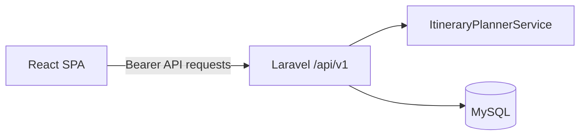

# Architecture

The frontend uses route-level UI modules and a lazy-loaded React Three Fiber scene. Laravel controllers validate requests, delegate itinerary calculations to a service, and expose versioned JSON endpoints.
