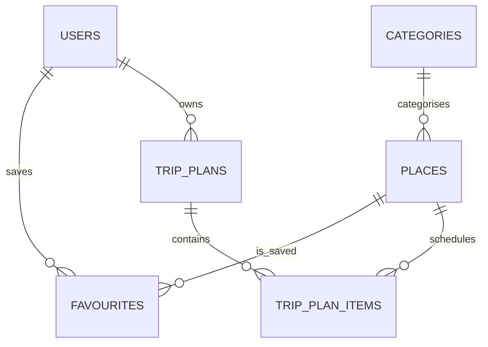

# Database design

`categories` groups `places`. Users can favourite and review places. Saved itineraries are stored in `trip_plans` and ordered `trip_plan_items`. Uniqueness constraints prevent duplicate favourites and duplicate reviews per user/place.

